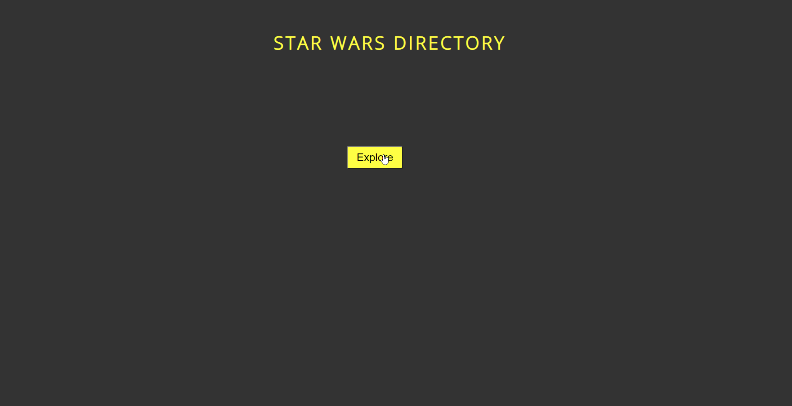


## vanilla-starwars-app

## Summary

This is a small app that utilizes fetch to grab data from the SWAPI (Star Wars API). The main purpose for this project was to re-familiarize myself with APIs. This included using fetch, asych/await, iterating over data, inserting cells and rows in a table via JS, appending, adding and removing classLists and event listeners.

 
Try it out here: [starwars-app](https://rfussell17.github.io/vanilla-starwars-app/)
 

 

 

The app iterates through the first 10 people in the API. Using await, the data will appear in the correct order and not whichever is fastest. The data needed is assigned to the correct cells in the table, retrieving the characters name, birth year, height and mass and appending it to the page. 

  
  

**Author**
 
**Robin Fussell** _- Software Developer_ | [LinkedIn](https://www.linkedin.com/in/robin-fussell17/)
